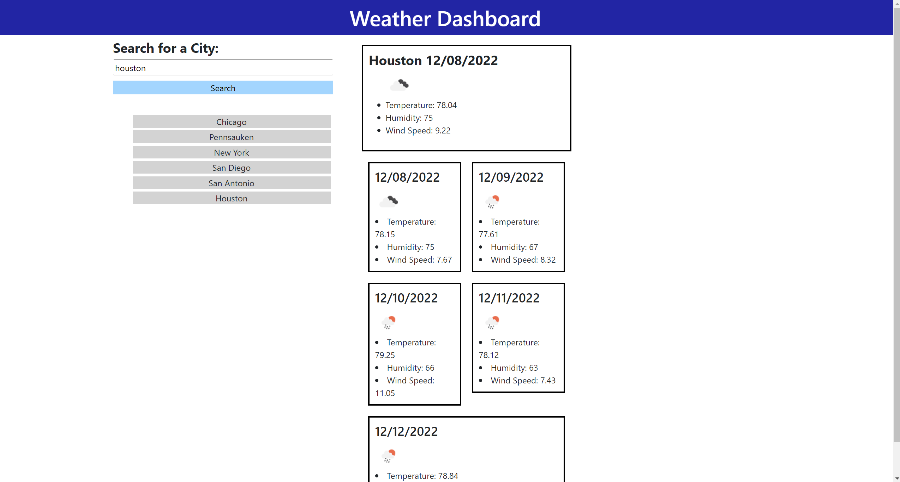

# weather-dashboard

## Description

You can get a 5-day weather forecast by typing in the city name. It will show the weather, temperature, wind speed, and humidity.

## Table of Contents

- [Installation](#installation)
- [Usage](#usage)
- [Credits](#credits)
- [License](#license)

## Installation

You can reach this webpage through any web browser. No installation is required.
https://azimezn.github.io/weather-dashboard/

## Usage

Type in a city name and a 5-day forecast will appear. It will store the last 5 searches and you can click on the city names in the search history to get the recent weather report again.

## Credits

- weather API from https://openweathermap.org/
- Rutgers University Coding Bootcamp
- [w3schools.com](W3schools.com)

## License

N/A
